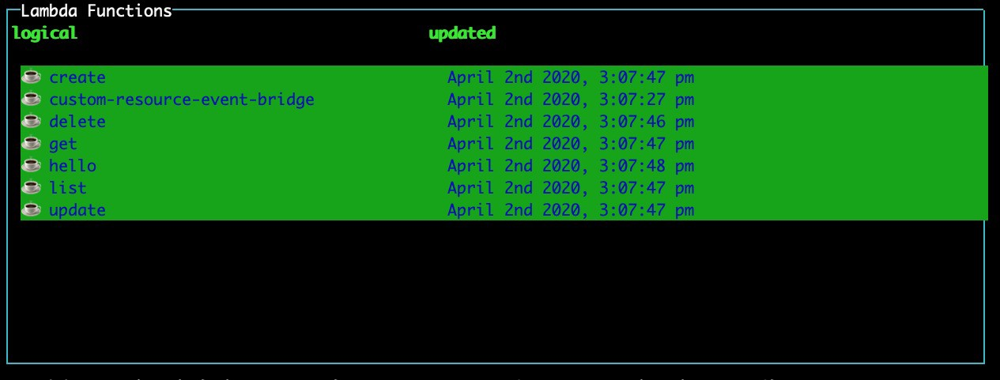
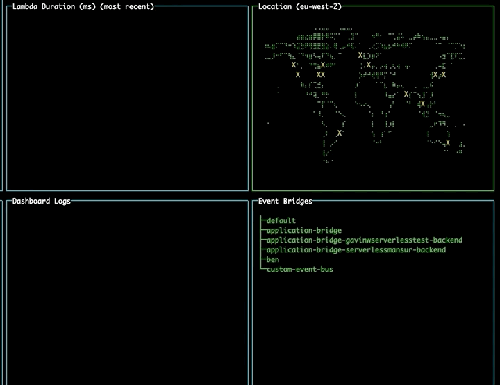
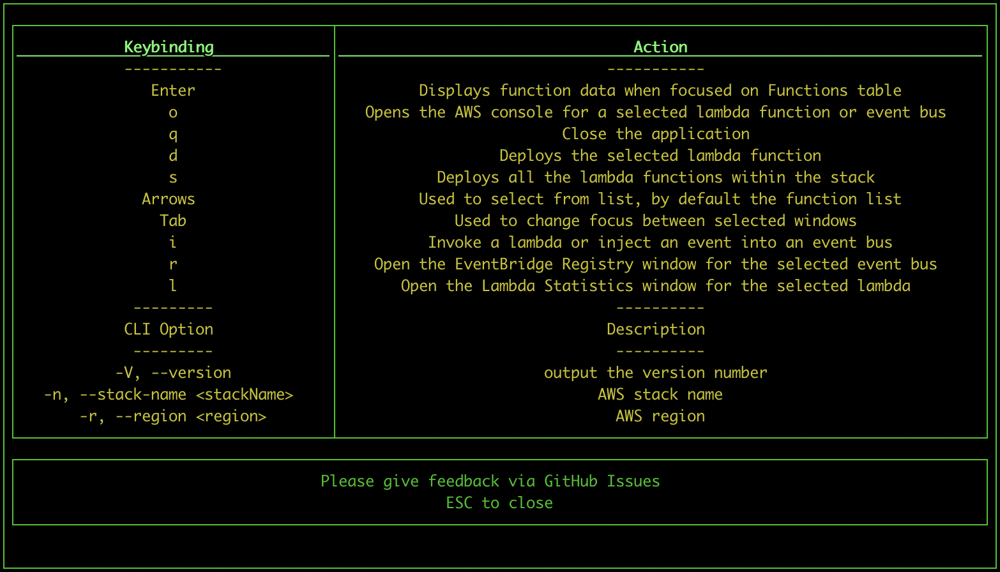
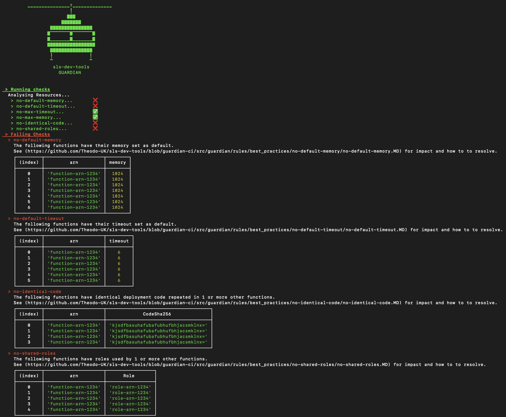

# sls-dev-tools

[](https://www.npmjs.com/package/sls-dev-tools)
[](https://github.com/Theodo-UK/sls-dev-tools/blob/master/LICENSE)
[](https://gitter.im/sls-dev-tools)
[](https://github.com/Theodo-UK/sls-dev-tools)
[](https://twitter.com/intent/tweet?text=@SlsDevTools)
[](https://twitter.com/SlsDevTools)

[](https://circleci.com/gh/Theodo-UK/sls-dev-tools)
[](https://lgtm.com/projects/g/Theodo-UK/sls-dev-tools/context:javascript)

<!-- ALL-CONTRIBUTORS-BADGE:START - Do not remove or modify this section -->

[](#contributors-)

<!-- ALL-CONTRIBUTORS-BADGE:END -->

The Developer Tools for the Serverless World - think Chrome Dev Tools but for Serverless.

- 💻Rapid In-Terminal Feedback (no more jumping to the AWS Console)
- 📊Targeted metrics to empower you to build fast and efficient applications
- ⌨️ Powerful keybindings to deploy, inject, open and manipulate stack resources without the clicks
- 🛠Works with **any** IaC, from the Serverless Framework to SAM

sls-dev-tools is an open source project, and we welcome and encourage all issues and PRs. A number of our features have come directly from user suggestions and additions so if you have an idea, send it our way!

## Maintenance

sls-dev-tools is currently being actively maintained. If you find a problem with the tool, let us know and we'll solve it as quickly as possible.

[Docs Site](https://theodo-uk.github.io/sls-dev-tools)

[📹YouTube Demo Video](https://youtu.be/bBA6upK5Ugk)


[Installation](#installation)\
[Usage](#usage)

- [Options](#options)

[Frameworks](#frameworks)

- [Serverless framework](#serverless-framework)
- [SAM framework](#sam-framework)
- [Other frameworks](#other-frameworks)

[Features](#features)

- [Navigating the tool](#navigating-the-tool)
- [Viewing all stack resources](#viewing-all-stack-resources)
- [Viewing statistics and recent calls](#viewing-statistics-and-recent-calls)
- [Deploying lambdas](#deploying-lambdas)
  - [Single lambda deploy](#single-lambda-deploy)
  - [Full stack deploy](#full-stack-deploy)
- [Invoking Lambdas](#invoking-lambdas)
- [EventBridge](#eventbridge)
  - [Injecting events](#injecting-events)
  - [EventBridge Schema Registry](#eventbridge-schema-registry)
- [Shortcuts to AWS Console](#shortcuts-to-aws-console)
- [Changing region using the map](#changing-region-using-the-map)
- [Shortcuts](#shortcuts)
- [Guardian](#guardian)
  - [Usage](#usage-1)
  - [Configuring Rules](#configuring-rules)

[A note on AWS API calls and pricing](#a-note-on-aws-api-calls-and-pricing)\
[Libs](#libs)\
[Contributing to the Project](#contributing-to-the-project)

- [Debugging](#debugging)

[Contributors ✨](#contributors-)

## Installation

- Run `npm install -D sls-dev-tools` or `yarn add -D sls-dev-tools` to add the tool to your project
- Alternatively run `npm install -g sls-dev-tools` to install the tool globally

## Usage


Run `sls-dev-tools` in your serverless project directory.

If the tool isn't able to find the stack name or region in local files or in the command arguments, it will open up a wizard to allow you to select the region and any available stacks.

If you have used CLI option variables to define the stack name in your serverless config files (e.g. `myproject-stack-${opt:env}`) then you can supply these CLI options to the sls-dev-tools command. (e.g. `sls-dev-tools --env myenv1`).


### Options:

`sls-dev-tools [-l {YOUR_PROJECT_LOCATION}] [-p {PROFILE}] [-n {YOUR_STACK_NAME}] [-r {YOUR_REGION}] [-t {START_TIME}] [-i {INTERVAL}]`

```
  -V, --version                 output the version number
  -n, --stack-name <stackName>  manually set AWS stack name
  -r, --region <region>         manually set AWS region
  -t, --start-time <startTime>  when to start from
  -i, --interval <interval>     interval of graphs, in seconds
  -p, --profile <profile>       aws profile name to use
  -h, --help                    output usage information
  -s, --stage <stage>           if using the serverless framework uses this as the stage option
  -l, --location                location of your serverless project (default is current directory)
  --sls                         use the serverless framework to execute commands
  --sam                         use the SAM framework to execute commands
  --ci                          run CI checks on your project with sls-dev-tools Guardian
```

- The location option allows you to specify the serverless project directory you want to work on.
- To find stack names, log on to AWS cloudformation. It is shown in the overview section of stack info. It may not be what you expected e.g. it might have `-dev` on the end, so worth checking if the dev tools are not working.
- The region is the AWS region, for example, us-east-1.
- The profile option allows you to pass in an alternative aws profile to connect with. If none is provided the default aws profile is used.
- The start time defines when you want your graphs to start from. The format for the start time is as follows: `'30 March 2020 09:00 GMT'`.
- The interval defines the size of the buckets in seconds. This means if you give a interval of 3600, the line graph will group the invocations and errors into 1h chunks, and the bar chart will show the average response time over the hour for the last 6 hours during which invocations were made.

## Frameworks

### Serverless framework

sls-dev-tools works with the serverless framework by default, and can be used by passing the `--sls` option when running the tool. If no option is passed, the serverless framework is used by default.

### SAM framework

To use the SAM framework, pass the `--sam` option when running the tool.

When using the sam framework extra arguments for capabilities and s3 bucket must be added to your slsdevtools.config.js file e.g.

```jsx
module.exports = {
  deploymentArgs:
    "--capabilities CAPABILITY_IAM --s3-bucket deployment-bucket-name",
};
```

### Other frameworks

The tool can be used with any other Cloudformation framework (such as Serverless Stack) by passing your stackname and region to the tool using the -n and -r options, respectively.

## Features

### Navigating the tool

Use the arrow keys to move around each pane. Use tab to switch between different panes.

### Viewing all stack resources

Use the left and right arrow keys to navigate to the a list of all resources in the stack e.g. SNS, API Gateway, Dynamo DB. More functionality coming to this table soon!


### Viewing statistics and recent calls

Select a lambda function and press enter to display statistics for the function. The line graph shows the number of invocations and errors for that lambda within the time interval. The bar chart shows the response time of the 5 most recent invocations. The logs for that function will also appear in the Server Logs pane.

If you get an `AccessDenied` error in which case you must add the `GetMetricData` permission from CloudWatch in the IAM console on AWS.

If you're not seeing any data in the graphs, try changing your start date to make sure you have had invocations since then.


### Deploying lambdas

It's necessary to run the tool within your serverless project folder, or specify its location using the `-l` option, for deployment features to work.

#### Single lambda deploy

Select a lambda and press 'd' to deploy it.

#### Full stack deploy

You can also press 's' to deploy your entire stack.



### Invoking lambdas

Pressing 'i' with a lambda selected will open up a modal which will allow you to invoke a lambda. Fill the parameters field for any parameters you wish to invoke the lambda with and press submit to trigger the invocation.

### EventBridge

On opening the tool, the EventBridge pane will display all the event buses currently available to you.

#### Injecting events

Navigate to the EventBridge pane using tab. Select an event bus and press 'i' to open the Event Injection modal. Navigate the fields using the arrow keys, and press enter to toggle edit mode. Navigate to the submit button and press enter to inject the event directly onto the event bus from within the tool.

#### EventBridge Schema Registry

Navigate to the EventBridge pane using tab. Select an event bus and press 'r' to open the Event Registry modal. This modal allows you to explore the EventBridge Schema Registry, and displays your custom registries, as well as the discovered-schemas registry. Selecting a registry will show you the schemas it contains. Upon selecting a schema, the tool will automatically detect the required properties for that event and generate a form for submitting these properties. If your event has more than 5 properties, you can use the right and left arrow keys to view each page of properties. Pressing submit will take you to the Event Injection modal, prefilling the detail field for you.


### Shortcuts to AWS Console

Select an event bus or lambda and press 'o' to open the AWS console page for that resource in your browser.

### Changing region using the map

Navigate to the map pane using tab. Use the arrow keys to select a different region and press enter to change to that region, updating your lambdas and event buses without needing to restart the tool.



## Shortcuts



```
Shortcuts
- Pressing "h" while the tool is open will display a help-box with all the keybindings and cli options
- Pressing "q" will quit the tool
- Pressing "o" while selecting a function from the function list will open the relevant page of the AWS console (saving some clicks!)
- Pressing "d" while selecting a function from the function list will deploy the selected lambda function, note this is not possible while using SAM
- Pressing "s" while selecting a function will deploy the entire stack
- Pressing "i" will invoke a lambda or inject an event into an event bus depending on selection
- Pressing "r" while selecting an event bus will open the event registry. Select a event schema to edit the event properties, and inject it on that bus.
- Pressing "l" will display a box with more statistics on the selected lambda
```

## Guardian


sls-dev-tools Guardian in a highly opinionated, highly configurable, automated best-practice audit tool for Serverless architectures. Like all sls-dev-tools it's framework agnostic and can be run in one simple command.

sls-dev-tools Guardian can run locally, on a CI Platform or in a scheduled task to help you build with best practices from day one and resolve problems before they arise.

### Usage

To run sls-dev-tools Guardian use the same command structure, but pass the —ci option:

- `sls-dev-tools --ci [-l {YOUR_PROJECT_LOCATION}] [-p {PROFILE}] [-n {YOUR_STACK_NAME}] [-r {YOUR_REGION}] [-t {START_TIME}] [-i {INTERVAL}]`



### Configuring rules

sls-dev-tools is intended to be opinionated, but when that opinion does not match your expectations rules can be ignored on a per resource or global level.

To ignore a rule add a guardian section to your slsdevtools.config.js file

```jsx
module.exports = {
	guardian: {
		ignore: {
			"no-max-memory": true, // global
      "no-max-memory": ["arn-1234"] // per resource
      "no-max-memory": "1 May 2020 09:00 GMT" // ignore until a particular date
    }
	}
};
```

Rules can be ignored globally, per resource or until a specific date (e.g. delay checking this for 1 month).

# A note on AWS API calls and pricing

This tool does make use of the AWS API to get metrics. Authentication is handled implicitly via the AWS NodeJS SDK. Pricing around Cloudwatch is designed for scale, but be warned that this tool is making calls to AWS.

Full details on AWS API pricing can be found here:

- https://aws.amazon.com/cloudwatch/pricing/

For instance, the cost of GetMetricData as of 25/08/19 was \$0.01 per 1,000 metrics requested.

- This tool take no liability in pricing data provided and please use AWS's docs to ensure pricing is appropriate for you.

The current list of calls made by the tool:

- CloudFormation: listStackResources
- CloudWatch: getMetricData
- CloudWatchLogs: describeLogStreams, filterLogEvents
- More may be added, check code for full list

## AWS IAM Policy

This tool needs these permissions to execute the features.

| Action                     | Features       |
| :------------------------- | :------------- |
| `lambda:ListFunctions`     | View, Guardian |
| `cloudwatch:GetMetricData` | View           |
| `logs:DescribeLogStreams`  | View           |
| `logs:FilterLogEvents`     | View           |
| `events:ListEventBuses`    | View           |

# Libs

Heavily based off the amazing [blessed](https://github.com/chjj/blessed) and [blessed-contrib](https://github.com/yaronn/blessed-contrib) projects.

## Contributing to the Project

### Debugging

sls-dev-tools has a predefined debug configuration for Visual Studio Code. If you would like to use this, please follow these steps after cloning the repository:

1. Build the project with source maps using `yarn build-maps`.
2. Run the project with a node debugger attached using `yarn debug` plus any options that you would provide to the sls-dev-tools command.
3. Navigate to VS Code's debug side panel, ensure that the 'Attach' configuration is selected in the dropdown next to the green 'Run' arrow.
4. Press the green 'Run' arrow.

Now you can add breakpoints throughout the source code and debug using VS Code's extensive debugging features.

## Contributors ✨

Thanks goes to these wonderful people ([emoji key](https://allcontributors.org/docs/en/emoji-key)):

<!-- ALL-CONTRIBUTORS-LIST:START - Do not remove or modify this section -->
<!-- prettier-ignore-start -->
<!-- markdownlint-disable -->
<table>
  <tr>
    <td align="center"><a href="https://medium.com/serverless-transformation"><br /><sub><b>Ben Ellerby</b></sub></a><br /><a href="https://github.com/Theodo-UK/sls-dev-tools/commits?author=BenEllerby" title="Code">💻</a> <a href="#content-BenEllerby" title="Content">🖋</a> <a href="https://github.com/Theodo-UK/sls-dev-tools/commits?author=BenEllerby" title="Documentation">📖</a> <a href="#ideas-BenEllerby" title="Ideas, Planning, & Feedback">🤔</a> <a href="#design-BenEllerby" title="Design">🎨</a> <a href="#talk-BenEllerby" title="Talks">📢</a> <a href="https://github.com/Theodo-UK/sls-dev-tools/pulls?q=is%3Apr+reviewed-by%3ABenEllerby" title="Reviewed Pull Requests">👀</a></td>
    <td align="center"><a href="https://github.com/DotGav"><br /><sub><b>Gavin Williams</b></sub></a><br /><a href="https://github.com/Theodo-UK/sls-dev-tools/commits?author=DotGav" title="Code">💻</a> <a href="https://github.com/Theodo-UK/sls-dev-tools/commits?author=DotGav" title="Documentation">📖</a> <a href="#ideas-DotGav" title="Ideas, Planning, & Feedback">🤔</a> <a href="#maintenance-DotGav" title="Maintenance">🚧</a> <a href="https://github.com/Theodo-UK/sls-dev-tools/pulls?q=is%3Apr+reviewed-by%3ADotGav" title="Reviewed Pull Requests">👀</a> <a href="#security-DotGav" title="Security">🛡️</a></td>
    <td align="center"><a href="https://github.com/mansurpasha"><br /><sub><b>Mansur Pasha</b></sub></a><br /><a href="https://github.com/Theodo-UK/sls-dev-tools/commits?author=mansurpasha" title="Code">💻</a> <a href="https://github.com/Theodo-UK/sls-dev-tools/commits?author=mansurpasha" title="Documentation">📖</a> <a href="#userTesting-mansurpasha" title="User Testing">📓</a> <a href="#blog-mansurpasha" title="Blogposts">📝</a></td>
    <td align="center"><a href="https://github.com/antoineeudes"><br /><sub><b>Antoine Eudes</b></sub></a><br /><a href="https://github.com/Theodo-UK/sls-dev-tools/commits?author=antoineeudes" title="Code">💻</a> <a href="https://github.com/Theodo-UK/sls-dev-tools/commits?author=antoineeudes" title="Documentation">📖</a> <a href="#userTesting-antoineeudes" title="User Testing">📓</a> <a href="#blog-antoineeudes" title="Blogposts">📝</a></td>
    <td align="center"><a href="https://github.com/luce-theodo"><br /><sub><b>Luc Esplin</b></sub></a><br /><a href="#projectManagement-luce-theodo" title="Project Management">📆</a> <a href="#userTesting-luce-theodo" title="User Testing">📓</a></td>
    <td align="center"><a href="http://emboldenher.org"><br /><sub><b>AbbieHowell</b></sub></a><br /><a href="https://github.com/Theodo-UK/sls-dev-tools/commits?author=AbbieHowell" title="Code">💻</a> <a href="https://github.com/Theodo-UK/sls-dev-tools/commits?author=AbbieHowell" title="Documentation">📖</a></td>
    <td align="center"><a href="https://github.com/robcronin"><br /><sub><b>Rob Cronin</b></sub></a><br /><a href="https://github.com/Theodo-UK/sls-dev-tools/commits?author=robcronin" title="Code">💻</a></td>
  </tr>
  <tr>
    <td align="center"><a href="https://github.com/serkan-ozal"><br /><sub><b>Serkan ÖZAL</b></sub></a><br /><a href="https://github.com/Theodo-UK/sls-dev-tools/commits?author=serkan-ozal" title="Code">💻</a></td>
    <td align="center"><a href="http://www.artoliukkonen.net"><br /><sub><b>Arto Liukkonen</b></sub></a><br /><a href="https://github.com/Theodo-UK/sls-dev-tools/commits?author=artoliukkonen" title="Code">💻</a></td>
    <td align="center"><a href="https://blog.james-mullen.me.uk"><br /><sub><b>James Mullen</b></sub></a><br /><a href="https://github.com/Theodo-UK/sls-dev-tools/commits?author=jnmullen" title="Code">💻</a></td>
    <td align="center"><a href="https://evalphobia.dev/"><br /><sub><b>evalphobia</b></sub></a><br /><a href="https://github.com/Theodo-UK/sls-dev-tools/commits?author=evalphobia" title="Documentation">📖</a></td>
    <td align="center"><a href="https://github.com/bgowers"><br /><sub><b>Ben Gowers</b></sub></a><br /><a href="https://github.com/Theodo-UK/sls-dev-tools/commits?author=BenEllerby" title="Code">💻</a> <a href="https://github.com/Theodo-UK/sls-dev-tools/commits?author=evalphobia" title="Documentation">📖</a></td>
  </tr>
</table>

<!-- markdownlint-enable -->
<!-- prettier-ignore-end -->

<!-- ALL-CONTRIBUTORS-LIST:END -->

This project follows the [all-contributors](https://github.com/all-contributors/all-contributors) specification. Contributions of any kind welcome!
