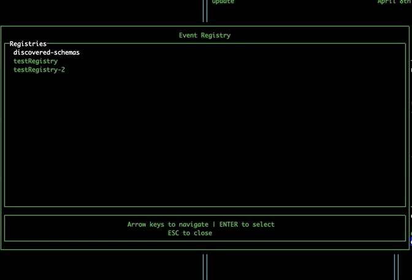
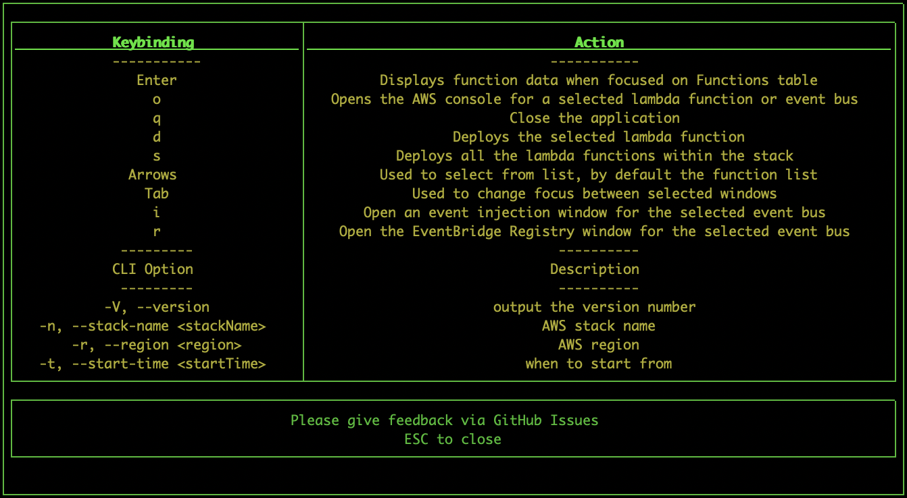

## Installation

- Run `npm install -D sls-dev-tools` or `yarn add -D sls-dev-tools` to add the tool to your project
- Alternatively run `npm install -g sls-dev-tools` to install the tool globally

## Usage


Run `sls-dev-tools` in the directory with your serverless.yml

### Options:

`sls-dev-tools [-l {YOUR_PROJECT_LOCATION}] [-p {PROFILE}] [-n {YOUR_STACK_NAME}] [-r {YOUR_REGION}] [-t {START_TIME}] [-i {INTERVAL}]`

```
  -V, --version                 output the version number
  -n, --stack-name <stackName>  manually set AWS stack name
  -r, --region <region>         manually set AWS region
  -t, --start-time <startTime>  when to start from
  -i, --interval <interval>     interval of graphs, in seconds
  -p, --profile <profile>       aws profile name to use
  -h, --help                    output usage information
  -l, --location                location of your serverless project (default is current directory)
  --sls                         use the serverless framework to execute commands
  --sam                         use the SAM framework to execute commands
```

- The location option allows you to specify the serverless project directory you want to work on.
- To find stack names, log on to AWS cloudformation. It is shown in the overview section of stack info. It may not be what you expected e.g. it might have `-dev` on the end, so worth checking if the dev tools are not working.
- The region is the AWS region, for example, us-east-1.
- The profile option allows you to pass in an alternative aws profile to connect with. If none is provided the default aws profile is used.
- The start time defines when you want your graphs to start from. The format for the start time is as follows: `'30 March 2020 09:00 GMT'`.
- The interval defines the size of the buckets in seconds. This means if you give a interval of 3600, the line graph will group the invocations and errors into 1h chunks, and the bar chart will show the average response time over the hour for the last 6 hours during which invocations were made.

## Frameworks

### Serverless framework

sls-dev-tools works with the serverless framework by default, and can be used by passing the `--sls` option when running the tool. If no option is passed, the serverless framework is used by default.

### SAM framework

To use the SAM framework, pass the `--sam` option when running the tool.

When using the sam framework extra arguments for capabilites and s3 bucket must be added in the slsdevtools.config.js e.g. `--capabilities CAPABILITY_IAM --s3-bucket deployment-bucket-name` [Example SLS Dev Tools Config](slsdevtools.config.js.dist)

## Features

### Navigating the tool

Use the arrow keys to move around each pane. Use tab to switch between different panes.

### Viewing statistics and recent calls

Select a lambda function and press enter to display statistics for the function. The line graph shows the number of invocations and errors for that lambda within the time interval. The bar chart shows the response time of the 5 most recent invocations. The logs for that function will also appear in the Server Logs pane.

If you get an `AccessDenied` error in which case you must add the `GetMetricData` permission from CloudWatch in the IAM console on AWS.

If you're not seeing any data in the graphs, try changing your start date to make sure you have had invocations since then.


### Deploying lambdas

It's necessary to run the tool within your serverless project folder, or specify its location using the `-l` option, for deployment features to work.

#### Single lambda deploy

Select a lambda and press 'd' to deploy it.

#### Full stack deploy

You can also press 's' to deploy your entire stack.


### EventBridge

On opening the tool, the EventBridge pane will display all the event buses currently available to you.

#### Injecting events

Navigate to the EventBridge pane using tab. Select an event bus and press 'i' to open the Event Injection modal. Navigate the fields using the arrow keys, and press enter to toggle edit mode. Navigate to the submit button and press enter to inject the event directly onto the event bus from within the tool.

#### EventBridge Schema Registry

Navigate to the EventBridge pane using tab. Select an event bus and press 'r' to open the Event Registry modal. This modal allows you to explore the EventBridge Schema Registry, and displays your custom registries, as well as the discovered-schemas registry. Selecting a registry will show you the schemas it contains. Upon selecting a schema, the tool will automatically detect the required properties for that event and generate a form for submitting these properties. If your event has more than 5 properties, you can use the right and left arrow keys to view each page of properties. Pressing submit will take you to the Event Injection modal, prefilling the detail field for you.



### Shortcuts to AWS Console

Select an event bus or lambda and press 'o' to open the AWS console page for that resource in your browser.

### Changing region using the map

Navigate to the map pane using tab. Use the arrow keys to select a different region and press enter to change to that region, updating your lambdas and event buses without needing to restart the tool.


## Shortcuts



```
Shortcuts
- Pressing "h" while the tool is open will display a helpbox with all the keybindings and cli options
- Pressing "q" will quit the tool
- Pressing "o" while selecting a function from the function list will open the relevant page of the AWS console (saving some clicks!)
- Pressing "d" while selecting a function from the function list will deploy the selected lambda function, note this is not possible while using SAM
- Pressing "s" while selecting a function will deploy the entire stack
- Pressing "i" while selecting an event bus will open a window to write and inject an event for that bus
- Pressing "r" while selecting an event bus will open the event registry. Select a event schema to edit the event properties, and inject it on that bus.
```

# A note on AWS API calls and pricing

This tool does make use of the AWS API to get metrics. Authentication is handled implicitly via the AWS NodeJS SDK. Pricing around Cloudwatch is designed for scale, but be warned that this tool is making calls to AWS.

Full details on AWS API pricing can be found here:

- https://aws.amazon.com/cloudwatch/pricing/

For instance, the cost of GetMetricData as of 25/08/19 was \$0.01 per 1,000 metrics requested.

- This tool take no liability in pricing data provided and please use AWS's docs to ensure pricing is appropriate for you.

The current list of calls made by the tool:

- CloudFormation: listStackResources
- CloudWatch: getMetricData
- CloudWatchLogs: describeLogStreams, filterLogEvents
- More may be added, check code for full list

# Libs

Heavily based off the amazing [blessed](https://github.com/chjj/blessed) and [blessed-contrib](https://github.com/yaronn/blessed-contrib) projects.

## Core Team

| [Ben Ellerby](https://github.com/BenEllerby)                            | [Abbie Howell](https://github.com/abbiehowell)                           | [Rob Cronin](https://github.com/robcronin)                             | [Gavin Williams](https://github.com/DotGav)               | [Antoine Eudes](https://github.com/antoineeudes)                          | [Mansur Pasha](https://github.com/mansurpasha)               | [Luc Esplin](https://github.com/luce-theodo)               |
| ----------------------------------------------------------------------- | ------------------------------------------------------------------------ | ---------------------------------------------------------------------- | --------------------------------------------------------- | ------------------------------------------------------------------------- | ------------------------------------------------------------ | ---------------------------------------------------------- |
|  |  |  |  |  |  |  |
